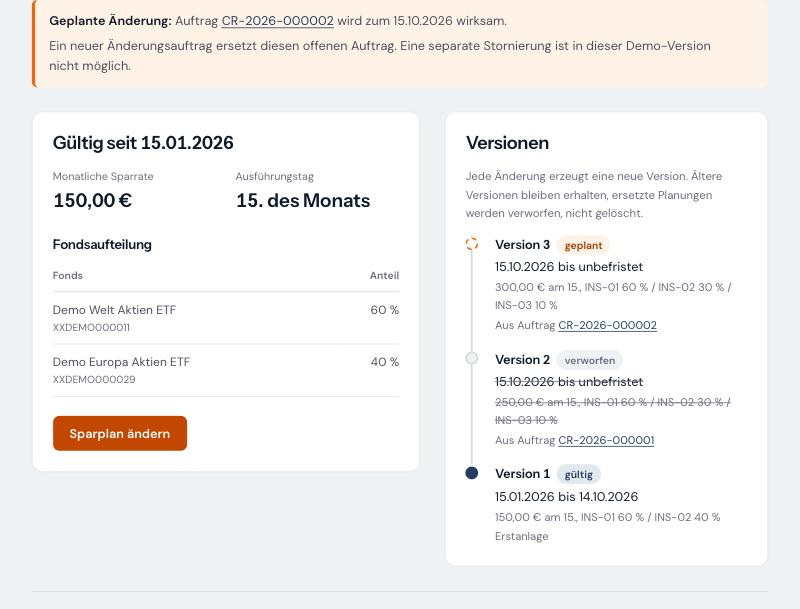
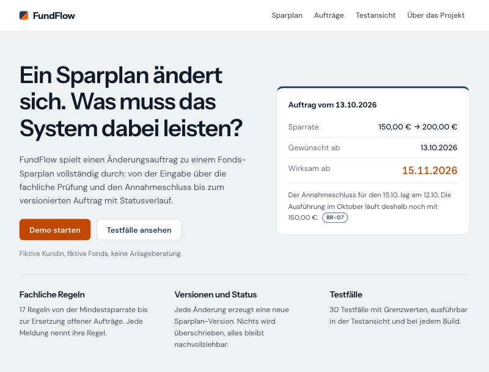
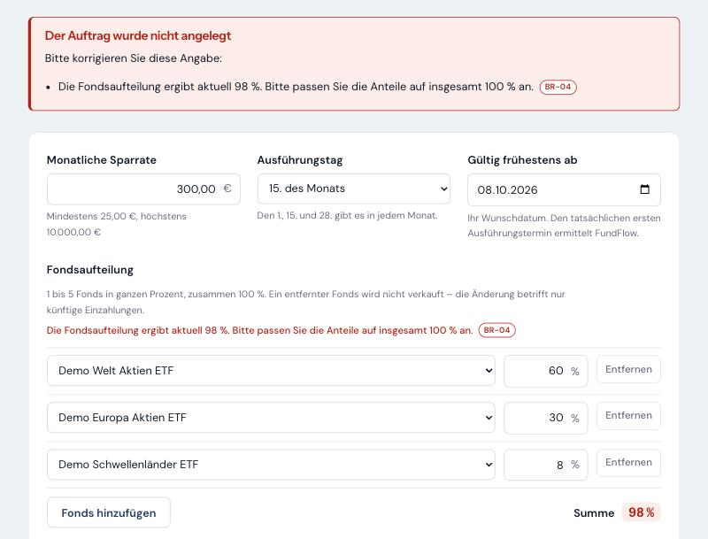
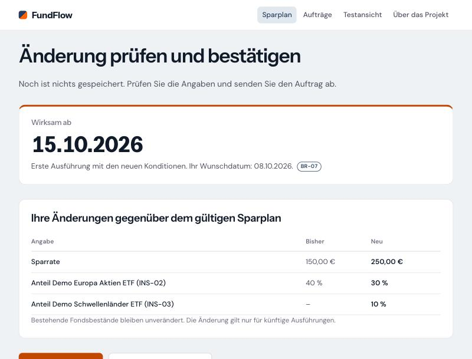
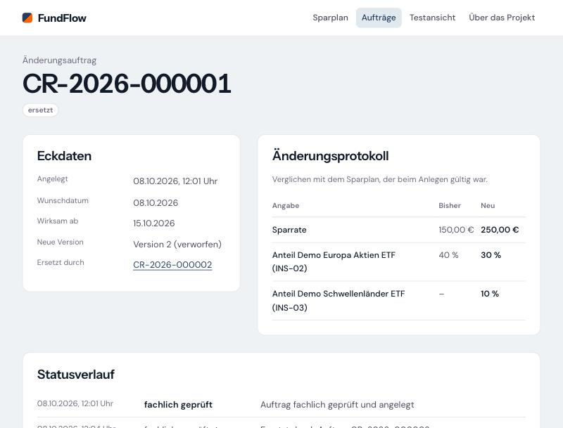
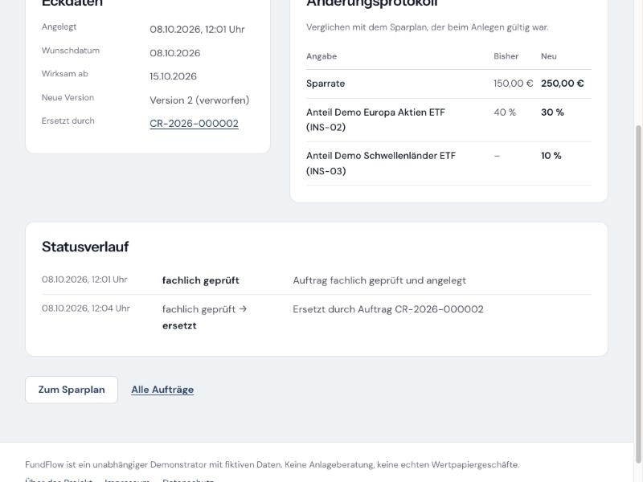
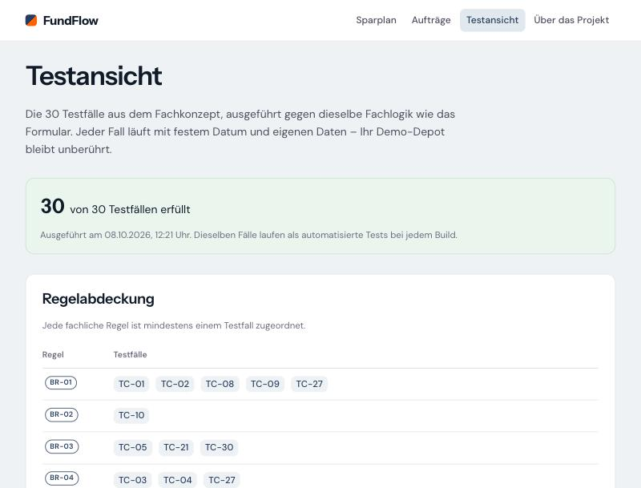

# FundFlow

**Business-Analysis-Prototyp für Änderungen an Fonds-Sparplänen**

Fiktive Daten · keine Anlageberatung · unabhängiges Demonstrationsprojekt

FundFlow zeigt an einem einzigen Vorgang, wie aus einer fachlichen Anforderung eine getestete Umsetzung wird: Eine Kundin ändert ihren Fonds-Sparplan – Sparrate, Ausführungstag oder Fondsaufteilung. Das System prüft die Eingaben gegen 17 fachliche Regeln, ermittelt unter Berücksichtigung eines Annahmeschlusses, ab wann die Änderung gilt, ersetzt einen noch offenen Auftrag und hält jede Änderung als Version mit Statusverlauf und Protokoll fest.



> FundFlow ist ein unabhängiger Demonstrator für die fachliche Analyse und technische Umsetzung von Änderungsaufträgen zu fiktiven Fonds- und ETF-Sparplänen. Die Anwendung verwendet ausschließlich Beispieldaten und dient weder der Anlageberatung noch der Durchführung realer Wertpapiergeschäfte.

## Rundgang in fünf Minuten

1. **Fachkonzept** – [docs/01_Fachkonzept.md](docs/01_Fachkonzept.md): Prozess (Abschnitt 7), Regeln (8), Statusmodell (9), Testfälle mit Rückverfolgbarkeit (12).
2. **Demo** – Sparplan ändern, eine Fondsaufteilung von 60 / 30 / 8 % absenden und die Meldung mit Regelkennung ansehen; danach zwei Aufträge nacheinander anlegen und den Statusverlauf vergleichen.
3. **Testansicht** – alle 30 Testfälle mit erwartetem und tatsächlichem Wert je Prüfung und die Regelabdeckung.
4. **Fehlerbericht** – [docs/04_Fehlerbericht_DEF-001.md](docs/04_Fehlerbericht_DEF-001.md): ein bewusst nachgestellter Fehler, seine Entdeckung durch die Testfälle, Ursache, Behebung und Erkenntnisse.
5. **Code** – die Regeln in [ChangeRequestValidator.cs](src/FundFlow.Domain/Rules/ChangeRequestValidator.cs), die Auftragsanlage in einem Schritt in [ChangeRequestService.cs](src/FundFlow.Infrastructure/Orders/ChangeRequestService.cs).

## Was das Projekt zeigt

| Aufgabe in der Business-Analyse | Nachweis im Projekt |
|---|---|
| Anforderungen erheben und strukturieren | Fachkonzept mit Glossar, Prozess, Regelkatalog und Abgrenzung |
| Zwischen Fachbereich und IT übersetzen | Regeln mit IDs, Meldungstexten und Rechenformel; dieselben IDs in Code und Tests |
| User Stories und Akzeptanzkriterien | sechs Stories für Kundin, Operations und Test |
| Datenmodell und Prozessdesign | versionierter Sparplan, Statusmodell mit zulässigen Übergängen |
| Testfälle definieren und ausführen | 30 Testfälle mit Grenzwerten; automatisiert und in der Anwendung ausführbar |
| Fehler fachlich und technisch analysieren | Fehlerbericht DEF-001 mit nachvollziehbarer Historie |
| Konzept und Umsetzung abgleichen | ein Test liest das Fachkonzept ein und vergleicht es mit dem Testkatalog |

## Arbeitsweise

FundFlow ist mit KI-Unterstützung (Claude Code) entstanden – fachlich gesteuert:

- **Konzept vor Code.** Jede Etappe begann erst nach Freigabe; jede Abweichung wurde zuerst im Fachkonzept beschrieben und freigegeben, dann umgesetzt.
- **Befunde aus der Umsetzung.** Beim Programmieren fielen Lücken im Konzept auf – etwa ein Hinweistext, der bei geändertem Ausführungstag eine Ausführung ankündigte, die es nicht gibt. Sie sind als Versionen 1.3 bis 1.5 des Fachkonzepts dokumentiert.
- **Gegenproben.** In jeder Etappe wurde absichtlich ein Fehler eingebaut, um zu prüfen, dass die Tests ihn finden ([Testbericht](docs/03_Testbericht.md), Abschnitt 4).

## Ansichten

| | |
|---|---|
|  |  |
| Startseite mit einem Beispiel zum Annahmeschluss | Fehlerfall 98 %: Meldung mit Regelkennung, kein Auftrag |
|  |  |
| Prüfen und bestätigen: Wirksamkeitstermin und Änderungen | Auftrag mit Änderungsprotokoll, ersetzt durch Folgeauftrag |
|  |  |
| Statusverlauf mit Begründung | Testansicht: 30 von 30 erfüllt, Regelabdeckung |

## Dokumentation

| Dokument | Inhalt |
|---|---|
| [01_Fachkonzept.md](docs/01_Fachkonzept.md) | Fachliche Grundlage: Prozess, Regeln, Status, Daten, User Stories, Testfälle, Entscheidungen |
| [02_Architektur.md](docs/02_Architektur.md) | Technische Umsetzung und Entscheidungen |
| [03_Testbericht.md](docs/03_Testbericht.md) | Teststrategie, Ergebnisse, Gegenproben, manuelle Prüfung |
| [04_Fehlerbericht_DEF-001.md](docs/04_Fehlerbericht_DEF-001.md) | Fehlerbeispiel von der Entdeckung bis zur Behebung |

## Technik

.NET 10 · ASP.NET Core Razor Pages · Entity Framework Core mit SQLite · xUnit

Die Fachlogik ist von Oberfläche und Datenbank getrennt und ohne beide testbar. Jede Besucherin und jeder Besucher arbeitet mit einer eigenen Kopie der Musterdaten; nach 24 Stunden ohne Aktivität werden sie gelöscht. Einzelheiten: [Architektur](docs/02_Architektur.md).

**Tests:** 179 automatisierte Tests auf fünf Ebenen – Regeln, Verarbeitung, Testkatalog, Rückverfolgbarkeit, Oberfläche. Einzelheiten: [Testbericht](docs/03_Testbericht.md).

## Lokal starten

Voraussetzung: .NET SDK 10.

```bash
dotnet test
dotnet run --project src/FundFlow.Web
```

Die Anwendung ist danach unter <http://localhost:5085> erreichbar. Die SQLite-Datenbank wird beim ersten Start unter `src/FundFlow.Web/App_Data/` angelegt.

## Projektstruktur

```
docs/                         Fachkonzept, Architektur, Testbericht, Fehlerbericht, Screenshots
src/FundFlow.Domain/          Fachlogik: Regeln, Wirksamkeitstermin, Statusmodell
src/FundFlow.Infrastructure/  Datenhaltung, Auftragsanlage, Demo-Sitzungen
src/FundFlow.Scenarios/       Testfälle TC-01 bis TC-30 als Daten
src/FundFlow.Web/             Oberfläche (Razor Pages)
tests/FundFlow.Tests/         automatisierte Tests
```

## Projektstand

| Etappe | Inhalt | Stand |
|---|---|---|
| 0 | Grundgerüst | erledigt |
| 1 | Fachregeln | erledigt |
| 2 | Wirksamkeitstermin | erledigt |
| 3 | Datenhaltung und Auftrag | erledigt |
| 4 | Testszenarien | erledigt |
| 5 | Oberfläche | erledigt |
| 6 | Fehlerbeispiel DEF-001 | erledigt |
| 7 | Dokumentation und Feinschliff | erledigt |
| 8 | Veröffentlichung | offen |

## Gestaltung und Schriften

Farben und Schriften nach [inspiras.de](https://www.inspiras.de). Die Schriften Instrument Sans und DM Sans sind lokal eingebunden und stehen unter der SIL Open Font License (siehe `src/FundFlow.Web/wwwroot/fonts`).

## Kontakt

Inspiras, Klaus Baqué · [Impressum](https://www.inspiras.de/impressum/)
