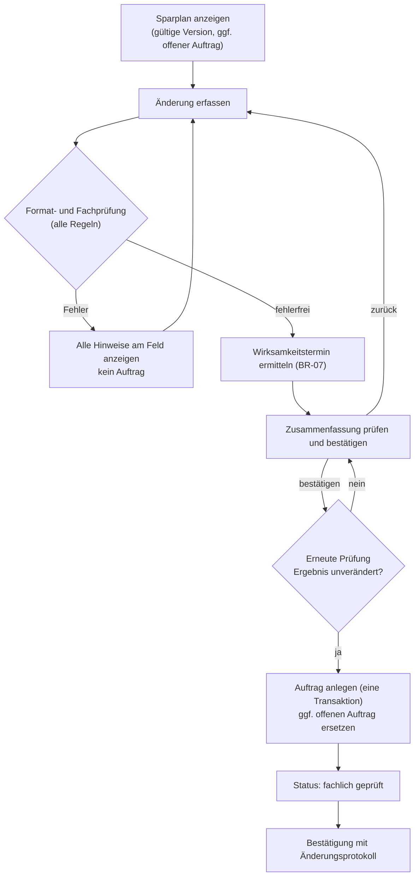
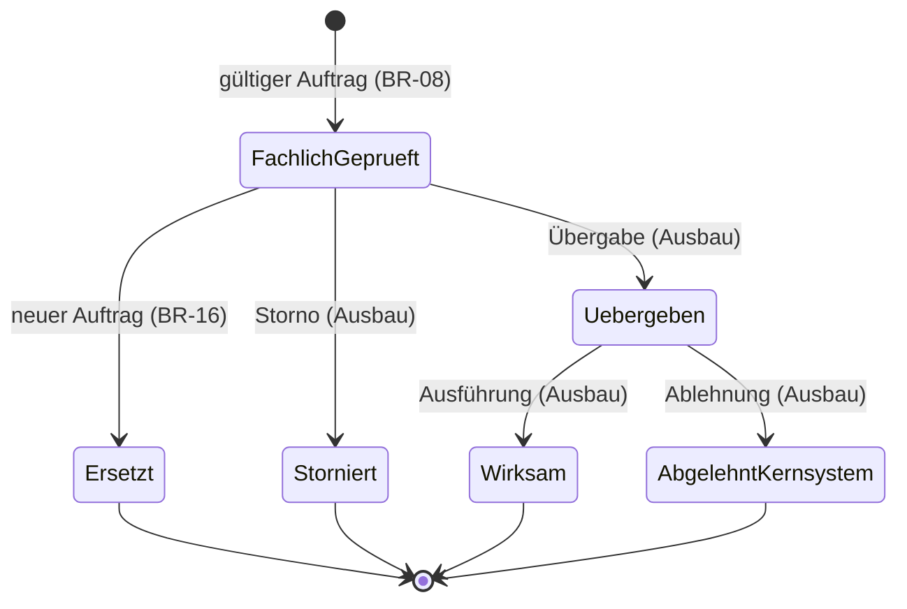
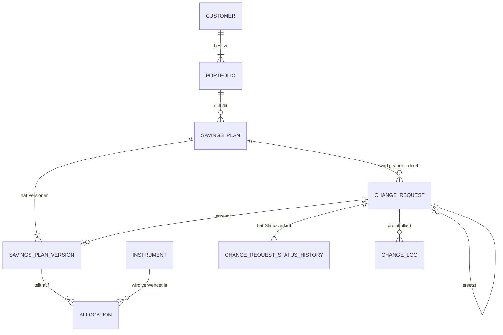

# FundFlow – Fachkonzept

**Version:** 1.3  
**Stand:** 8. Oktober 2026  
**Status:** Fachlich freigegeben – Entscheidungen E-01 bis E-12 und Version 1.3 am 08.10.2026 bestätigt

## 0. Änderungshistorie

### Version 1.3

| Bereich | Änderung |
|---|---|
| BR-07 | Zweite Formulierung des Verschiebungshinweises, wenn sich der Ausführungstag ändert: Am verpassten Termin findet dann keine Ausführung nach altem Plan statt (Befund aus der Umsetzung). |
| Testfälle | TC-30 für diesen Fall ergänzt. |
| Formatprüfung | Abschnitt 8.5 „Auslegung der Eingabeprüfung“ ergänzt (Befunde aus Etappe 1). |

### Version 1.2

| Bereich | Änderung |
|---|---|
| Freigabe | Entscheidungen E-01 bis E-12 bestätigt. |
| Demo-Betrieb | Trennung der Demo-Daten über eine Sitzungs-ID in einer gemeinsamen SQLite-Datenbank (Abschnitt 14, E-11). |
| Oberfläche | Hinweis, dass offene Aufträge ersetzt, aber in Version 1 nicht separat storniert werden können (BR-16, US-05, E-09). |

### Version 1.1 (gegenüber 1.0)

| Bereich | Änderung |
|---|---|
| Begriffe | Glossar ergänzt. „Wirksamkeitsdatum“ aufgeteilt in **Wunschdatum** (Eingabe) und **Wirksamkeitstermin** (vom System ermittelt). |
| Fachregeln | BR-07 präzisiert (Annahmeschluss 3 Kalendertage, Berechnungsformel). Neue Regeln BR-09 bis BR-17 für Höchstbetrag, ganze Prozent, Fondsanzahl, Doppelungen, Sparplanfähigkeit, Datumsgrenze, „keine Änderung“, Ersetzung offener Aufträge und Formatprüfung. |
| Fondsuniversum | Feste Liste von sieben fiktiven Instrumenten; Fonds können hinzugefügt und entfernt werden. |
| Prozess | Schritt „Prüfen und bestätigen“ ergänzt; erneute Prüfung beim Absenden. |
| Statusmodell | Vollständiges Zustandsmodell mit Kennzeichnung, welche Übergänge Version 1 umsetzt. |
| Datenmodell | Sparplan-Versionen (`SavingsPlanVersion`) eingeführt; Fondsaufteilung hängt an der Version; Statusverlauf ergänzt. |
| Mehrfachaufträge | Regel für einen bereits offenen Auftrag (BR-16). |
| Testfälle | Von 7 auf 29 erweitert, inkl. Grenzwerte; feste Ausgangsstände und Referenzdatum; Rückverfolgbarkeitsmatrix Regel ↔ Testfall. |
| Demo-Betrieb | Jede Besucherin und jeder Besucher arbeitet auf einer eigenen Kopie der Musterdaten; Reset-Funktion. |
| Technik | Razor Pages festgelegt; .NET 10 LTS; steuerbare Systemzeit (`TimeProvider`); gemeinsame Testfalldefinition für xUnit und Testansicht. |

## 1. Kurzbeschreibung

**FundFlow** ist ein interaktiver Demonstrator für die fachliche und technische Verarbeitung eines Änderungsauftrags zu einem Fonds- oder ETF-Sparplan. Anhand eines fiktiven Depots kann eine Kundin oder ein Kunde eine bestehende Sparplanvereinbarung ändern. Das System prüft die Eingaben gegen fachliche Regeln, ermittelt den Wirksamkeitstermin, erzeugt einen nachvollziehbaren Auftrag und dokumentiert die Änderung in einem Änderungsprotokoll.

Der Prototyp zeigt exemplarisch, wie fachliche Anforderungen in User Stories, Datenmodelle, Validierungsregeln, Testfälle und eine technische Umsetzung überführt werden können. Er ist als unabhängiges Portfolio-Projekt konzipiert und steht in keinem Zusammenhang mit einem realen Institut oder dessen Produkten.

**Wichtiger Hinweis:** Sämtliche Kundendaten, Fonds, Regeln und Vorgänge sind fiktiv. FundFlow ist keine Anlageberatung, keine Depotanwendung und kein rechtsverbindlicher Vorsorge- oder Steuerrechner.

## 2. Zielsetzung

FundFlow soll folgende Fähigkeiten sichtbar machen:

- Analyse und Strukturierung einer fachlichen Anforderung im Fonds- und Vorsorgeumfeld
- Übersetzung zwischen Kundensicht, Fachbereich und IT
- Formulierung von User Stories und überprüfbaren Akzeptanzkriterien
- Modellierung von Kernobjekten, Versionen und Statusübergängen
- Umsetzung und Test fachlicher Validierungs- und Ableitungsregeln
- Nachvollziehbare Dokumentation von Auftrag, Status und Fehlerfällen

Die erste Version konzentriert sich bewusst auf **einen vollständigen, durchgängigen Prozess** statt auf viele nur angedeutete Funktionen.

## 3. Ausgangslage und fachlicher Kontext

Ein Fonds-Sparplan besteht bereits. Die Kundin oder der Kunde möchte diesen an eine veränderte finanzielle Situation oder eine neue gewünschte Anlageaufteilung anpassen. Für das fachliche System muss dabei sichergestellt werden, dass der Auftrag vollständig, plausibel und rechtzeitig zur nächsten Ausführung verarbeitet wird.

Eine Sparplanänderung wirkt **ausschließlich auf künftige Ausführungen**. Bestehende Fondsbestände im Depot bleiben unverändert; wird ein Fonds aus dem Sparplan entfernt, wird er nicht verkauft.

Der Änderungsauftrag berührt mehrere Perspektiven:

| Perspektive | Erwartung |
|---|---|
| Kundin/Kunde | Änderung verständlich erfassen, vor dem Absenden sehen, ab wann sie gilt, und sofort erkennen, ob sie wirksam eingereicht wurde. |
| Fachbereich | Fachliche Regeln einheitlich anwenden und nachvollziehbar dokumentieren. |
| Operations | Aufträge mit klarer Wirksamkeit, belastbarem Status und Statusverlauf weiterverarbeiten können. |
| IT | Eindeutige Datenobjekte, Validierungslogik, Statusübergänge und Testfälle erhalten. |

## 4. Glossar

| Begriff | Bedeutung |
|---|---|
| Ausführungstag | Tag im Monat, an dem der Sparplan ausgeführt wird: 1., 15. oder 28. |
| Ausführungstermin | Konkretes Kalenderdatum einer Ausführung, z. B. 15.10.2026. |
| Wunschdatum | Von der Kundin eingegebenes Datum, ab dem die Änderung frühestens gelten soll. |
| Annahmeschluss | Spätester Eingangstag für einen Ausführungstermin: 3 Kalendertage vor dem Termin. |
| Wirksamkeitstermin | Erster Ausführungstermin, der mit den neuen Konditionen ausgeführt wird. Wird vom System ermittelt (BR-07). |
| Gültige Version | Die Sparplan-Version, die heute gilt. |
| Geplante Version | Eine durch einen Auftrag erzeugte Version, die erst ab dem Wirksamkeitstermin gilt. |
| Offener Auftrag | Ein Änderungsauftrag im Status „fachlich geprüft“, dessen Wirksamkeitstermin noch nicht erreicht ist. |
| Referenzdatum | Für Tests festgelegtes „heute“. Alle Datumsangaben beziehen sich auf die Zeitzone Europe/Berlin. |

## 5. Produktumfang der Version 1

### 5.1 Im Umfang

1. Anzeige eines fiktiven Musterdepots mit einem bestehenden Fonds-/ETF-Sparplan, inklusive Hinweis auf einen offenen Auftrag.
2. Änderung von monatlicher Sparrate, Ausführungstag, Wunschdatum und Fondsaufteilung; Hinzufügen und Entfernen von Fonds aus einer festen Fondsliste.
3. Prüfung der Eingaben durch Format- und Fachregeln; alle Fehler werden gleichzeitig angezeigt.
4. Ermittlung des Wirksamkeitstermins mit verständlichem Hinweis bei Verschiebung.
5. Zusammenfassung „Prüfen und bestätigen“ vor dem Absenden.
6. Anlage eines Änderungsauftrags mit eindeutiger Auftragsnummer, Zeitstempel, Status und Statusverlauf.
7. Versionierung des Sparplans (gültige und geplante Version).
8. Ersetzung eines offenen Auftrags durch einen neuen gültigen Auftrag.
9. Änderungsprotokoll mit alter und neuer Ausprägung.
10. Auftragsübersicht und Auftragsdetail für Operations.
11. Testansicht mit fachlichen Positiv- und Negativfällen.
12. Eigene Demo-Daten je Besuchersitzung und Funktion „Demo zurücksetzen“.
13. Dokumentation der Anforderung, des Prozesses, Datenmodells und der Testfälle im Projekt-Repository.

### 5.2 Nicht im Umfang

- echte Depotführung, Zahlungsverkehr oder Wertpapierorders
- Anbindung an reale Markt-, Kunden- oder Fonds-Stammdaten
- Anlageempfehlungen, Geeignetheits- oder Angemessenheitsprüfung
- Berechnung von Steuern, Förderungen, Gebühren oder Renditen
- Benutzerkonten, Authentifizierung und produktive Verarbeitung personenbezogener Daten
- Abbildung instituts- oder produktspezifischer Vertragsbedingungen
- Bankarbeitstage, Feiertage und Verschiebung von Terminen am Wochenende (Version 1 rechnet in Kalendertagen)
- Stornierung eines offenen Auftrags und Statusübergänge nach „fachlich geprüft“ (siehe Abschnitt 9, Ausbaustufen)
- Mindestbetrag je Fondsposition
- Umschichtung bestehender Fondsbestände

## 6. Nutzerrollen

### 6.1 Depotkundin / Depotkunde

Nutzt die Anwendung, um einen bestehenden Sparplan anzusehen, zu ändern und eine verständliche Rückmeldung zu erhalten.

### 6.2 Fachbereich / Product Owner

Definiert Regeln und beurteilt, ob die Anforderungen durch die Umsetzung vollständig erfüllt sind.

### 6.3 Operations / Backoffice

Benötigt eine eindeutige Auftragsreferenz, einen Status mit Verlauf und ein Änderungsprotokoll für die weitere Bearbeitung.

### 6.4 Testerin / Tester

Prüft anhand definierter Testfälle, ob fachliche Regeln richtig umgesetzt wurden und Fehlerfälle verständlich behandelt werden.

## 7. Fachlicher Prozess

1. Die Kundin öffnet ihren fiktiven Sparplan. Angezeigt werden die gültige Version und – falls vorhanden – der offene Auftrag mit Wirksamkeitstermin.
2. Sie öffnet das Änderungsformular. Startwerte sind die Werte des offenen Auftrags, falls einer existiert, sonst die der gültigen Version. Existiert ein offener Auftrag, weist das Formular darauf hin, dass ein neuer Auftrag ihn ersetzt und dass eine separate Stornierung in dieser Version nicht möglich ist.
3. Sie passt Sparrate, Ausführungstag, Wunschdatum und/oder Fondsaufteilung an. Die laufende Summe der Anteile wird während der Eingabe angezeigt.
4. FundFlow prüft Format und fachliche Regeln. Alle Verstöße werden gleichzeitig am jeweiligen Feld angezeigt; es wird kein Auftrag angelegt.
5. Bei erfolgreicher Prüfung ermittelt FundFlow den Wirksamkeitstermin (BR-07) und zeigt eine Zusammenfassung: Änderungen gegenüber der gültigen Version, Wirksamkeitstermin, gegebenenfalls Hinweis auf Verschiebung und auf die Ersetzung eines offenen Auftrags.
6. Die Kundin bestätigt. FundFlow prüft **erneut** alle Regeln und ermittelt den Wirksamkeitstermin neu (zwischenzeitlich kann z. B. der Annahmeschluss überschritten sein). Weicht das Ergebnis ab, wird die Zusammenfassung mit Hinweis erneut angezeigt.
7. FundFlow legt den Auftrag in einem Schritt an (siehe BR-08): Auftragsnummer, Zeitstempel, Status „fachlich geprüft“, geplante Sparplan-Version, Änderungsprotokoll, gegebenenfalls Ersetzung des offenen Auftrags.
8. Die Bestätigungsseite zeigt Auftragsnummer, Wirksamkeitstermin und Änderungsprotokoll.

## 8. Fachliche Regeln

### 8.1 Regelarten

- **Formatprüfung:** Eingabe ist technisch lesbar (Zahl, Datum).
- **Validierung:** Verstoß blockiert die Anlage des Auftrags. Alle Validierungsregeln werden gemeinsam ausgewertet; alle Verstöße werden gleichzeitig angezeigt. Ist ein Feld nicht lesbar (BR-17), entfallen die weiteren Prüfungen für dieses Feld.
- **Ableitung:** Das System berechnet einen Wert und informiert gegebenenfalls, blockiert aber nicht.
- **Systemregel:** Verhalten des Systems ohne Nutzermeldung.

Alle Regeln werden serverseitig geprüft. Prüfungen in der Oberfläche dienen nur dem Komfort.

### 8.2 Regelkatalog

Die Nummern aus Version 1.0 bleiben unverändert; neue Regeln werden fortlaufend angehängt.

| ID | Art | Regel | Meldung bei Verletzung |
|---|---|---|---|
| BR-01 | Validierung | Die monatliche Sparrate beträgt mindestens 25,00 €. | „Bitte geben Sie eine monatliche Sparrate von mindestens 25,00 € ein.“ |
| BR-02 | Validierung | Die Sparrate enthält höchstens zwei Nachkommastellen. | „Die Sparrate darf höchstens zwei Nachkommastellen enthalten.“ |
| BR-03 | Validierung | Zulässige Ausführungstage sind der 1., 15. und 28. eines Monats. | „Bitte wählen Sie einen gültigen Ausführungstag.“ |
| BR-04 | Validierung | Die Summe aller Zielanteile beträgt exakt 100 %. | „Die Fondsaufteilung ergibt aktuell X %. Bitte passen Sie die Anteile auf insgesamt 100 % an.“ |
| BR-05 | Validierung | Jeder Zielanteil ist größer als 0 %. | „Bitte entfernen Sie Fonds ohne Anteil oder geben Sie einen Anteil größer als 0 % ein.“ |
| BR-06 | Validierung | Das Wunschdatum liegt nicht in der Vergangenheit (heute ist zulässig). | „Das Wunschdatum muss heute oder später liegen.“ |
| BR-07 | Ableitung | Ermittlung des Wirksamkeitstermins unter Berücksichtigung des Annahmeschlusses (siehe 8.3). | Hinweis bei Verschiebung, Ausführungstag unverändert: „Ihr Auftrag geht nach dem Annahmeschluss für den {T} ein. Die Änderung wird daher erst zum {E} wirksam; die Ausführung am {T} erfolgt noch zu den bisherigen Konditionen.“ Ausführungstag geändert: „Ihr Auftrag geht nach dem Annahmeschluss für den {T} ein. Die Änderung wird daher erst zum {E} wirksam; bis dahin wird Ihr Sparplan zu den bisherigen Konditionen ausgeführt.“ |
| BR-08 | Systemregel | Ein gültiger Auftrag wird vollständig in einem Schritt angelegt (siehe 8.4). | – |
| BR-09 | Validierung | Die monatliche Sparrate beträgt höchstens 10.000,00 €. | „Die monatliche Sparrate darf höchstens 10.000,00 € betragen.“ |
| BR-10 | Validierung | Zielanteile sind ganze Prozentwerte. | „Bitte geben Sie die Anteile in ganzen Prozent an.“ |
| BR-11 | Validierung | Ein Sparplan enthält mindestens 1 und höchstens 5 Fonds. | „Ein Sparplan muss 1 bis 5 Fonds enthalten.“ |
| BR-12 | Validierung | Jeder Fonds kommt in einem Sparplan höchstens einmal vor. | „Jeder Fonds darf nur einmal im Sparplan enthalten sein.“ |
| BR-13 | Validierung | Nur Fonds aus dem Fondsuniversum, die als sparplanfähig gekennzeichnet sind, sind zulässig. | „Der Fonds ‚{Name}‘ ist derzeit nicht sparplanfähig.“ bzw. bei unbekannter ID „Der gewählte Fonds ist nicht verfügbar.“ |
| BR-14 | Validierung | Das Wunschdatum liegt höchstens 12 Monate nach heute. | „Das Wunschdatum darf höchstens zwölf Monate in der Zukunft liegen.“ |
| BR-15 | Validierung | Der Auftrag weicht in mindestens einer Angabe (Sparrate, Ausführungstag, Fondsaufteilung) **a)** von der gültigen Version und **b)** von einem offenen Auftrag ab. | a) „Ihre Eingaben entsprechen dem aktuell gültigen Sparplan. Bitte ändern Sie mindestens eine Angabe.“ b) „Diese Änderung liegt bereits als offener Auftrag {Nr.} vor.“ |
| BR-16 | Systemregel | Existiert für den Sparplan ein offener Auftrag, ersetzt ein neuer gültiger Auftrag diesen. Der bisherige Auftrag erhält den Status „ersetzt“, seine geplante Version wird verworfen. | Hinweis auf der Sparplanseite, im Formular und in der Zusammenfassung: „Dieser Auftrag ersetzt den offenen Auftrag {Nr.}. Eine separate Stornierung ist in dieser Demo-Version nicht möglich.“ |
| BR-17 | Formatprüfung | Sparrate ist ein Betrag im deutschen Zahlenformat; Wunschdatum ist ein gültiges Datum. | „Bitte geben Sie die Sparrate als Betrag ein, z. B. 150,00.“ / „Bitte geben Sie ein gültiges Datum ein.“ |

Die Regeln sind bewusst vereinfacht. Sie dienen ausschließlich der Demonstration, wie fachliche Logik nachvollziehbar beschrieben, implementiert und getestet wird.

### 8.3 Berechnung des Wirksamkeitstermins (BR-07)

Gegeben: heute `H`, Wunschdatum `W`, neuer Ausführungstag `d` (1, 15 oder 28), Vorlauf `V = 3` Kalendertage.

1. Frühestmögliches Datum: `F = max(W, H + V)`
2. Wirksamkeitstermin: `E` = erstes Datum ≥ `F`, dessen Tag im Monat `d` ist.
3. Verschiebungshinweis: Der erste Termin `T` mit Tag `d` und `T ≥ W` liegt vor `E` (er wurde wegen des Annahmeschlusses verpasst).

Bis einschließlich `E − 1 Tag` gilt die bisherige Version. Da nur der 1., 15. und 28. zulässig sind, existiert der Ausführungstag in jedem Monat.

**Beispiele (Ausführungstag 15):**

| Heute | Wunschdatum | F | Wirksamkeitstermin | Hinweis |
|---|---|---|---|---|
| 08.10.2026 | 08.10.2026 | 11.10.2026 | 15.10.2026 | nein |
| 12.10.2026 | 12.10.2026 | 15.10.2026 | 15.10.2026 | nein (Grenzwert) |
| 13.10.2026 | 13.10.2026 | 16.10.2026 | 15.11.2026 | ja, 15.10. verpasst |

**Ausführungstag geändert:** `T` ist ein Termin mit dem *neuen* Ausführungstag. Nach dem bisherigen Plan findet an `T` keine Ausführung statt; der Hinweis nennt deshalb nur, dass bis `E` die bisherigen Konditionen gelten.

| Heute | Wunschdatum | Ausführungstag | F | Wirksamkeitstermin | Hinweis |
|---|---|---|---|---|---|
| 30.10.2026 | 30.10.2026 | 15 → 1 | 02.11.2026 | 01.12.2026 | ja, 01.11. verpasst; allgemeine Formulierung |

### 8.4 Verarbeitung bei Anlage (BR-08)

Die folgenden Schritte erfolgen in **einer Transaktion** – entweder vollständig oder gar nicht:

1. Erneute Prüfung aller Regeln und Neuberechnung des Wirksamkeitstermins. Erst danach wird eine Auftragsnummer vergeben.
2. Falls ein offener Auftrag existiert (BR-16): Status → „ersetzt“, Eintrag im Statusverlauf, zugehörige geplante Version als verworfen markieren.
3. Gültige Version: `validTo = E − 1 Tag`.
4. Neue Version (fortlaufende Versionsnummer) mit `validFrom = E` und neuer Fondsaufteilung anlegen.
5. Auftrag anlegen: Auftragsnummer `CR-JJJJ-NNNNNN` (fortlaufend je Jahr), Zeitstempel (UTC gespeichert, Anzeige Europe/Berlin), Status „fachlich geprüft“, Wunschdatum, Wirksamkeitstermin, Verweis auf ersetzten Auftrag und neue Version; erster Eintrag im Statusverlauf.
6. Änderungsprotokoll: ein Eintrag je geänderter Angabe, **verglichen mit der gültigen Version** (ein ersetzter Auftrag wird nie wirksam und ist daher keine Vergleichsbasis).
   - Sparrate, Ausführungstag: alter und neuer Wert.
   - Fondsaufteilung: ein Eintrag je Fonds, dessen Anteil sich geändert hat; hinzugefügte Fonds mit altem Wert „–“, entfernte Fonds mit neuem Wert „–“.

Es wird nichts gelöscht: Ersetzte Aufträge und verworfene Versionen bleiben mit ihrem Status erhalten.

### 8.5 Auslegung der Eingabeprüfung

| Eingabe | Behandlung | Regel |
|---|---|---|
| Sparrate „250.50“ (Punkt als Dezimaltrennzeichen) | Formatfehler – wird nicht als 25.050 € gelesen | BR-17 |
| Sparrate „1.234,56“, „250“, „250,00 €“ | gültig | – |
| Sparrate „-20“ | Verstoß gegen den Mindestbetrag | BR-01 |
| Anteil nicht lesbar, z. B. „abc“ | Meldung „ganze Prozent“; Summenprüfung entfällt | BR-10 |
| Anteil mit Prozentzeichen, z. B. „60 %“ | gültig | – |
| Ausführungstag nicht lesbar | Meldung „gültiger Ausführungstag“ | BR-03 |
| Wunschdatum „2026-10-08“ (Datumsfeld) oder „08.10.2026“ | gültig | – |
| Sparplan ohne Fonds | zwei Meldungen: Anzahl und Summe 0 % | BR-11, BR-04 |
| Nur das Wunschdatum geändert | keine Änderung im Sinne von BR-15 | BR-15 |

## 9. Statusmodell

Abgelehnte Eingaben (Abschnitt 8, Validierung) erzeugen **keinen** Auftrag und damit keinen Status.

| Status | Bedeutung | Version 1 |
|---|---|---|
| fachlich geprüft | Auftrag ist gültig angelegt und wartet auf Übergabe an das Kernsystem. | umgesetzt |
| ersetzt | Durch einen neueren Auftrag ersetzt (BR-16). Endstatus. | umgesetzt |
| storniert | Von der Kundin zurückgenommen. Endstatus. | nur modelliert |
| an Kernsystem übergeben | Ab hier nicht mehr ersetzbar oder stornierbar. | nur modelliert |
| wirksam | Neue Version gilt ab dem Wirksamkeitstermin. Endstatus. | nur modelliert |
| vom Kernsystem abgelehnt | Technische oder fachliche Ablehnung im Kernsystem. Endstatus. | nur modelliert |

Jeder Statuswechsel wird im Statusverlauf mit Zeitpunkt und Grund festgehalten.

## 10. Daten

### 10.1 Kernobjekte

| Objekt | Zweck | Wichtige Attribute |
|---|---|---|
| Customer | Fiktive Depotinhaberin bzw. fiktiver Depotinhaber | customerId, name |
| Portfolio | Fiktives Depot | portfolioId, customerId, depotNumber, status |
| SavingsPlan | Sparplanvereinbarung (Klammer über alle Versionen) | savingsPlanId, portfolioId, planNumber, status |
| SavingsPlanVersion | Konditionen eines Sparplans in einem Zeitraum | versionId, savingsPlanId, versionNo, monthlyAmount, executionDay, validFrom, validTo (leer = unbefristet), isDiscarded, createdByRequestId (leer bei Erstanlage) |
| Allocation | Aufteilung einer Version auf Fonds/ETFs | allocationId, versionId, instrumentId, percentage |
| Instrument | Fiktiver Fonds oder ETF | instrumentId, isinLikeId, name, assetClass, savingsPlanEligible |
| ChangeRequest | Änderungsauftrag | requestId, requestNumber, savingsPlanId, createdAt, status, requestedFrom, effectiveDate, effectiveDateShifted, replacesRequestId, resultingVersionId |
| ChangeRequestStatusHistory | Statusverlauf eines Auftrags | historyId, requestId, fromStatus, toStatus, changedAt, reason |
| ChangeLog | Vergleich gültige Version / neue Version | logId, requestId, fieldName, oldValue, newValue |
| DemoSession | Technisches Objekt für den Demo-Betrieb, kein Teil des fachlichen Modells (Abschnitt 14) | demoSessionId, createdAt, lastSeenAt |

**Datentypen:** Beträge als Dezimalzahl mit zwei Nachkommastellen (kein Gleitkommatyp), Anteile als ganze Zahl, Datumswerte ohne Uhrzeit, Zeitstempel in UTC.

### 10.2 Beziehungen

- Ein Customer besitzt mindestens ein Portfolio.
- Ein Portfolio kann mehrere SavingsPlans enthalten.
- Ein SavingsPlan hat mindestens eine Version; zu jedem Datum ist höchstens eine nicht verworfene Version gültig.
- Eine Version enthält 1 bis 5 Allocations.
- Ein ChangeRequest bezieht sich auf genau einen SavingsPlan und erzeugt höchstens eine Version.
- Pro SavingsPlan existiert höchstens ein offener ChangeRequest.

### 10.3 Fondsuniversum (fiktiv)

Die Kennungen beginnen mit „XX“, einem Ländercode, der in echten ISINs nicht vorkommt. Verwechslungen mit realen Wertpapieren sind dadurch ausgeschlossen.

| instrumentId | isinLikeId | Name | Anlageklasse | sparplanfähig |
|---|---|---|---|---|
| INS-01 | XXDEMO000011 | Demo Welt Aktien ETF | Aktien-ETF | ja |
| INS-02 | XXDEMO000029 | Demo Europa Aktien ETF | Aktien-ETF | ja |
| INS-03 | XXDEMO000037 | Demo Schwellenländer ETF | Aktien-ETF | ja |
| INS-04 | XXDEMO000045 | Demo Euro Staatsanleihen Fonds | Rentenfonds | ja |
| INS-05 | XXDEMO000052 | Demo Unternehmensanleihen ETF | Renten-ETF | ja |
| INS-06 | XXDEMO000060 | Demo Mischfonds Ausgewogen | Mischfonds | ja |
| INS-07 | XXDEMO000078 | Demo Immobilienfonds | Offener Immobilienfonds | nein (für Neuanlagen geschlossen) |

INS-07 wird in der Oberfläche nicht zur Auswahl angeboten. Er dient dem Nachweis, dass die serverseitige Prüfung (BR-13) auch manipulierte Anfragen abweist.

### 10.4 Musterdaten

| Objekt | Ausprägung |
|---|---|
| Kundin | Erika Musterfrau (fiktiv) |
| Depot | DEMO-000001 |
| Sparplan | SP-000001 |
| Version 1 | 150,00 €, Ausführungstag 15., gültig ab 15.01.2026, unbefristet |
| Aufteilung | INS-01 60 %, INS-02 40 % |
| Offene Aufträge | keine |

## 11. User Stories und Akzeptanzkriterien

### US-01: Sparrate ändern

**Als** Depotkundin  
**möchte ich** die monatliche Sparrate meines Sparplans ändern  
**damit** meine künftigen Einzahlungen meiner aktuellen finanziellen Situation entsprechen.

**Akzeptanzkriterien**

1. Das Formular zeigt die bisherige Sparrate als Ausgangswert (bei offenem Auftrag dessen Sparrate).
2. Sparraten unter 25,00 € oder über 10.000,00 € sowie Beträge mit mehr als zwei Nachkommastellen werden abgelehnt (BR-01, BR-02, BR-09).
3. Bei einer gültigen Sparrate erzeugt das System einen Änderungsauftrag.
4. Die bisherige und neue Sparrate erscheinen im Änderungsprotokoll.

### US-02: Fondsaufteilung ändern

**Als** Depotkunde  
**möchte ich** die Aufteilung meines Sparplans auf mehrere Fonds und ETFs ändern  
**damit** die zukünftige Anlage meinen Vorstellungen entspricht.

**Akzeptanzkriterien**

1. Die aktuelle Aufteilung ist sichtbar.
2. Jeder Anteil kann bearbeitet werden; Fonds aus der Liste sparplanfähiger Fonds können hinzugefügt und entfernt werden.
3. Die Anwendung zeigt die laufende Summe der Anteile an.
4. Ein Auftrag ist nur möglich, wenn die Summe exakt 100 % beträgt, alle Anteile ganze Zahlen größer 0 sind und der Sparplan 1 bis 5 verschiedene Fonds enthält (BR-04, BR-05, BR-10, BR-11, BR-12).
5. Bei Erfolg wird die geänderte Aufteilung je Fonds im Änderungsprotokoll ausgegeben.
6. Ein entfernter Fonds wird nicht verkauft; die Oberfläche weist darauf hin.

### US-03: Wirksamkeit nachvollziehen

**Als** Depotkundin  
**möchte ich** vor dem Absenden erkennen, ab wann meine Änderung wirksam wird  
**damit** ich meine künftigen Einzahlungen nachvollziehen kann.

**Akzeptanzkriterien**

1. Das System prüft das Wunschdatum (BR-06, BR-14).
2. Die Zusammenfassung zeigt den ermittelten Wirksamkeitstermin (BR-07).
3. Wird ein Termin wegen des Annahmeschlusses verpasst, erklärt das System die Verschiebung und nennt den Termin, der noch zu den bisherigen Konditionen ausgeführt wird.
4. Ändert sich der Wirksamkeitstermin zwischen Zusammenfassung und Absenden, wird die Zusammenfassung erneut mit Hinweis angezeigt.

### US-04: Fachliche Prüfung testen

**Als** Testerin  
**möchte ich** vordefinierte Testfälle ausführen oder einsehen  
**damit** die Umsetzung gegen die Fachregeln geprüft werden kann.

**Akzeptanzkriterien**

1. Jeder Testfall referenziert mindestens eine fachliche Regel.
2. Erwartetes und tatsächliches Ergebnis werden angezeigt.
3. Fehlgeschlagene Testfälle sind klar erkennbar.
4. Die Testfälle laufen mit festem Referenzdatum und eigenem Ausgangsstand und verändern die Demo-Daten nicht.

### US-05: Offene Änderung korrigieren

**Als** Depotkunde  
**möchte ich** eine bereits eingereichte, noch nicht wirksame Änderung korrigieren  
**damit** nicht zwei widersprüchliche Aufträge entstehen.

**Akzeptanzkriterien**

1. Der Sparplan und das Formular weisen auf einen offenen Auftrag hin.
2. Ein neuer gültiger Auftrag ersetzt den offenen Auftrag; dieser erhält den Status „ersetzt“ (BR-16).
3. Ein Auftrag, der dem offenen Auftrag inhaltlich entspricht, wird abgelehnt (BR-15 b).
4. Das Änderungsprotokoll des neuen Auftrags vergleicht mit der gültigen Version.
5. Die Oberfläche weist darauf hin, dass ein offener Auftrag durch einen neuen Auftrag ersetzt, aber nicht separat storniert werden kann (E-09).

### US-06: Auftrag nachvollziehen

**Als** Mitarbeiterin in Operations  
**möchte ich** zu einer Auftragsnummer Status, Statusverlauf, Wirksamkeitstermin und Änderungsprotokoll sehen  
**damit** ich Rückfragen beantworten und den Auftrag weiterverarbeiten kann.

**Akzeptanzkriterien**

1. Die Auftragsübersicht listet alle Aufträge des Musterdepots mit Nummer, Zeitstempel, Status und Wirksamkeitstermin.
2. Die Detailansicht zeigt Statusverlauf und Änderungsprotokoll.
3. Ersetzte Aufträge bleiben sichtbar und verweisen auf den ersetzenden Auftrag.

## 12. Testfälle für Version 1

### 12.1 Ausgangsstände und Konventionen

- **A0:** Musterdaten gemäß 10.4, kein offener Auftrag.
- **A1:** A0 zuzüglich offenem Auftrag CR-2026-000001: Sparrate 250,00 €, sonst unverändert, Wunschdatum 08.10.2026, Wirksamkeitstermin 15.10.2026, geplante Version 2.
- **Referenzdatum:** 08.10.2026, sofern nicht anders angegeben.
- Nicht genannte Eingaben entsprechen dem Ausgangsstand; Wunschdatum ist das Referenzdatum.
- Fälle mit ungültigem Ausführungstag oder nicht sparplanfähigem Fonds sind über die Oberfläche nicht auswählbar und werden als direkte Anfrage an die Fachlogik getestet.

### 12.2 Testfälle

| Test-ID | Ausgang | Eingabe | Erwartetes Ergebnis | Regeln |
|---|---|---|---|---|
| TC-01 | A0 | Sparrate 250,00 € | Auftrag angelegt, Wirksamkeitstermin 15.10.2026; Protokoll: Sparrate 150,00 € → 250,00 €. | BR-01, BR-08 |
| TC-02 | A0 | Sparrate 20,00 € | Abgelehnt, Meldung BR-01, kein Auftrag. | BR-01 |
| TC-03 | A0 | INS-01 50 %, INS-02 30 %, INS-03 20 % | Auftrag angelegt; Protokoll: INS-01 60 → 50, INS-02 40 → 30, INS-03 – → 20. | BR-04, BR-11 |
| TC-04 | A0 | INS-01 60 %, INS-02 30 %, INS-03 8 % | Abgelehnt, Meldung „… ergibt aktuell 98 % …“. Regressionstest zu DEF-001. | BR-04 |
| TC-05 | A0 | Ausführungstag 7 | Abgelehnt, Meldung BR-03. | BR-03 |
| TC-06 | A0 | Sparrate 200,00 €, Wunschdatum 07.10.2026 | Abgelehnt, Meldung BR-06. | BR-06 |
| TC-07 | A0 | Sparrate 200,00 €, Ausführungstag 1, INS-01 50 % / INS-02 50 % | Auftrag CR-2026-000001, Zeitstempel = Testzeit, Status „fachlich geprüft“, Statusverlauf mit einem Eintrag; Version 2 gültig ab 01.11.2026; Version 1 gültig bis 31.10.2026. | BR-08 |
| TC-08 | A0 | Sparrate 25,00 € | Auftrag angelegt (Grenzwert). | BR-01 |
| TC-09 | A0 | Sparrate 24,99 € | Abgelehnt, Meldung BR-01 (Grenzwert). | BR-01 |
| TC-10 | A0 | Sparrate 250,555 | Abgelehnt, Meldung BR-02. | BR-02 |
| TC-11 | A0 | Sparrate 10.000,00 € | Auftrag angelegt (Grenzwert). | BR-09 |
| TC-12 | A0 | Sparrate 10.000,01 € | Abgelehnt, Meldung BR-09 (Grenzwert). | BR-09 |
| TC-13 | A0 | INS-01 60 %, INS-02 40 %, INS-03 0 % | Abgelehnt, Meldung BR-05. | BR-05 |
| TC-14 | A0 | INS-01 33,5 %, INS-02 66,5 % | Abgelehnt, Meldung BR-10. | BR-10 |
| TC-15 | A0 | INS-01 bis INS-06 mit 20/20/20/20/10/10 % | Abgelehnt, Meldung BR-11. | BR-11 |
| TC-16 | A0 | INS-01 50 %, INS-01 50 % | Abgelehnt, Meldung BR-12. | BR-12 |
| TC-17 | A0 | INS-01 60 %, INS-07 40 % | Abgelehnt, Meldung BR-13 mit Fondsname. | BR-13 |
| TC-18 | A0 | Sparrate 200,00 €, Wunschdatum 08.10.2026 (heute) | Auftrag angelegt, Wirksamkeitstermin 15.10.2026, kein Verschiebungshinweis. | BR-06, BR-07 |
| TC-19 | A0, Referenzdatum 12.10.2026 | Sparrate 200,00 €, Wunschdatum 12.10.2026 | Auftrag angelegt, Wirksamkeitstermin 15.10.2026, kein Hinweis (Grenzwert Annahmeschluss). | BR-07 |
| TC-20 | A0, Referenzdatum 13.10.2026 | Sparrate 200,00 €, Wunschdatum 13.10.2026 | Auftrag angelegt, Wirksamkeitstermin 15.11.2026, Verschiebungshinweis nennt 15.10.2026. | BR-07 |
| TC-21 | A0 | Ausführungstag 1, Wunschdatum 20.10.2026 | Auftrag angelegt, Wirksamkeitstermin 01.11.2026, kein Hinweis; Protokoll: Ausführungstag 15 → 1. | BR-03, BR-07 |
| TC-22 | A0 | Sparrate 200,00 €, Wunschdatum 08.10.2027 | Auftrag angelegt, Wirksamkeitstermin 15.10.2027 (Grenzwert). | BR-14 |
| TC-23 | A0 | Sparrate 200,00 €, Wunschdatum 09.10.2027 | Abgelehnt, Meldung BR-14 (Grenzwert). | BR-14 |
| TC-24 | A0 | keine Änderung | Abgelehnt, Meldung BR-15 a. | BR-15 |
| TC-25 | A1 | Sparrate 300,00 € | Auftrag CR-2026-000002 „fachlich geprüft“, ersetzt CR-2026-000001; dieser hat Status „ersetzt“, Version 2 verworfen; Version 3 gültig ab 15.10.2026; Protokoll: Sparrate 150,00 € → 300,00 €. | BR-08, BR-16 |
| TC-26 | A0 | Sparrate „abc“ | Abgelehnt, Meldung BR-17. | BR-17 |
| TC-27 | A0 | Sparrate 20,00 €, INS-01 60 %, INS-02 30 %, INS-03 8 % | Abgelehnt, **beide** Meldungen (BR-01 und BR-04) werden gleichzeitig angezeigt. | BR-01, BR-04 |
| TC-28 | A1 | Sparrate 250,00 € (= offener Auftrag) | Abgelehnt, Meldung BR-15 b mit Nummer CR-2026-000001. | BR-15 |
| TC-29 | A1 | Sparrate 150,00 € (= gültige Version) | Abgelehnt, Meldung BR-15 a. Dokumentierte Einschränkung von Version 1: Rücknahme erst mit Storno (Ausbaustufe). | BR-15 |
| TC-30 | A0, Referenzdatum 30.10.2026 | Ausführungstag 1, Wunschdatum 30.10.2026 | Auftrag angelegt, Wirksamkeitstermin 01.12.2026; Verschiebungshinweis nennt 01.11.2026 in der allgemeinen Formulierung („bis dahin … bisherigen Konditionen“). | BR-03, BR-07 |

### 12.3 Rückverfolgbarkeit Regel ↔ Testfall

| Regel | Testfälle |
|---|---|
| BR-01 | TC-01, TC-02, TC-08, TC-09, TC-27 |
| BR-02 | TC-10 |
| BR-03 | TC-05, TC-21, TC-30 |
| BR-04 | TC-03, TC-04, TC-27 |
| BR-05 | TC-13 |
| BR-06 | TC-06, TC-18 |
| BR-07 | TC-18, TC-19, TC-20, TC-21, TC-30 |
| BR-08 | TC-01, TC-07, TC-25 |
| BR-09 | TC-11, TC-12 |
| BR-10 | TC-14 |
| BR-11 | TC-03, TC-15 |
| BR-12 | TC-16 |
| BR-13 | TC-17 |
| BR-14 | TC-22, TC-23 |
| BR-15 | TC-24, TC-28, TC-29 |
| BR-16 | TC-25 |
| BR-17 | TC-26 |

## 13. Fehlerbeispiel und Bearbeitung

**Fehler-ID:** DEF-001  
**Titel:** Änderungsauftrag wird trotz 98-prozentiger Fondsaufteilung angelegt  
**Kategorie:** Fachlicher Fehler  
**Betroffene Regel:** BR-04  
**Priorität:** Hoch

**Reproduktionsschritte**

1. Bestehenden Sparplan öffnen (Ausgangsstand A0).
2. Zielanteile auf INS-01 60 %, INS-02 30 % und INS-03 8 % setzen.
3. Änderung absenden.

**Erwartetes Ergebnis:** Der Auftrag wird nicht angelegt; das System weist darauf hin, dass die Summe 98 % beträgt.  
**Tatsächliches Ergebnis:** Der Auftrag wird angelegt.  
**Ursache:** Die Summenprüfung lief erst nach Vergabe der Auftragsnummer und wurde bei der Anlage nicht ausgewertet.  
**Behebung:** Alle Validierungen vor Vergabe der Auftragsnummer und vor dem Speichern ausführen (BR-08, Schritt 1).  
**Nachweis:** Regressionstest TC-04. Der Fehler wird im Repository bewusst nachgestellt, durch den Test aufgedeckt und mit einem eigenen, referenzierten Commit behoben.

## 14. Demo-Betrieb

- Jede Besucherin und jeder Besucher erhält beim ersten Aufruf eine eigene Kopie der Musterdaten (Ausgangsstand A0). Änderungen anderer Besucher sind nicht sichtbar.
- Die Zuordnung erfolgt über ein technisch notwendiges Sitzungs-Cookie; es gibt keine Tracking- oder Analyse-Cookies.
- Technische Umsetzung: **eine gemeinsame SQLite-Datenbank**. Alle sitzungsbezogenen Datensätze (Customer bis ChangeLog) tragen eine `demoSessionId`; der Datenzugriff filtert jede Abfrage automatisch auf die Sitzung der aktuellen Anfrage. Das Fondsuniversum ist sitzungsübergreifend und wird nur gelesen.
- Auftragsnummern sind datenbankweit eindeutig und fortlaufend. In der Demo beginnt die erste Nummer einer Sitzung daher nicht zwingend bei 000001; die Testfälle laufen mit eigenem, leerem Ausgangsstand.
- „Demo zurücksetzen“ stellt den Ausgangsstand A0 wieder her.
- Daten von Sitzungen, die 24 Stunden inaktiv sind, werden automatisch gelöscht.
- Die Demo verwendet das echte heutige Datum; die Testansicht verwendet ihr festes Referenzdatum.

## 15. Technische Zielarchitektur

Die Architektur soll dem fachlichen Ziel dienen und für einen Einzelentwickler beherrschbar bleiben.

| Ebene | Festlegung für Version 1 | Aufgabe |
|---|---|---|
| Plattform | .NET 10 (LTS) | Laufzeit und SDK |
| Benutzeroberfläche | ASP.NET Core Razor Pages | Musterdepot, Formular, Zusammenfassung, Bestätigung, Auftragsübersicht, Testansicht |
| Fachlogik | C#-Serviceklassen ohne Abhängigkeit zur Oberfläche | Validierungsregeln, Wirksamkeitstermin, Statusübergänge, Versionierung |
| Systemzeit | `TimeProvider` | Steuerbares „heute“ für Tests und Testansicht |
| Datenhaltung | SQLite | Muster- und Änderungsdaten je Demo-Sitzung |
| Datenzugriff | Entity Framework Core | Abbildung der Kernobjekte und Beziehungen |
| Tests | xUnit | Automatisierte Tests aller Testfälle TC-01 bis TC-30 |
| Bereitstellung | Docker-Container hinter Reverse Proxy | Reproduzierbarer Betrieb einer öffentlichen Demo |

Die Testfälle aus Abschnitt 12 werden **einmal** als Daten definiert und sowohl von den xUnit-Tests als auch von der Testansicht verwendet. Die Testansicht führt sie gegen dieselbe Fachlogik wie das Formular aus – mit festem Referenzdatum und einem eigenen Ausgangsstand im Speicher.

Für Version 1 genügt eine lokale SQLite-Datenbank. Eine produktive Datenbank, echte Kundendaten oder ein Core-Banking-System werden ausdrücklich nicht nachgebildet.

## 16. Qualitäts-, Datenschutz- und Sicherheitsprinzipien

- Es werden ausschließlich fiktive Beispieldaten verwendet.
- Es gibt keine Registrierung, keine Zahlungsdaten und keine Anlageentscheidungen.
- Alle Eingaben werden serverseitig validiert; Formulare sind gegen Cross-Site-Request-Forgery geschützt.
- Fehlerhinweise erklären das Problem verständlich, ohne technische Interna offenzulegen.
- Aufträge, Versionen und Statusverläufe werden nicht gelöscht oder überschrieben, sondern über Status und Verweise nachvollziehbar gehalten.
- Nur technisch notwendige Cookies; keine Tracking-Dienste.
- Das Repository enthält keine Zugangsdaten, Schlüssel oder produktionsnahe Konfiguration.

## 17. Erfolgskriterien

FundFlow ist für Version 1 erfolgreich umgesetzt, wenn:

1. ein Besucher einen Muster-Sparplan öffnen, ändern und vor dem Absenden den Wirksamkeitstermin sehen kann;
2. die Regeln BR-01 bis BR-17 nachvollziehbar umgesetzt sind;
3. die Testfälle TC-01 bis TC-30 dokumentiert, automatisiert und erfolgreich ausgeführt sind und jede Regel mindestens einem Testfall zugeordnet ist;
4. bei Erfolg ein Änderungsauftrag mit Statusverlauf, Sparplan-Version und Protokoll sichtbar wird;
5. bei Fehlern kein Auftrag angelegt wird und alle Meldungen verständlich und gleichzeitig angezeigt werden;
6. die Demo-Daten verschiedener Besucher voneinander getrennt sind;
7. das Repository Fachkonzept, User Stories, Datenmodell, Testfälle, Fehlerbeispiel und technische Startanleitung enthält;
8. die Anwendung unter einer neutralen öffentlichen Adresse als Demo verfügbar ist.

## 18. Entscheidungsprotokoll

Die folgenden Punkte waren in Version 1.0 offen. Sie wurden am 08.10.2026 bestätigt.

| ID | Entscheidung | Begründung | Alternative |
|---|---|---|---|
| E-01 | Annahmeschluss 3 Kalendertage vor dem Ausführungstermin; keine Bankarbeitstage | Einfach berechenbar und testbar; zeigt das Prinzip | Bankarbeitstage mit Feiertagskalender (Ausbaustufe) |
| E-02 | Kundin gibt ein Wunschdatum ein; das System ermittelt den Wirksamkeitstermin | Trennt Kundenwunsch und Systemlogik sauber | Kundin wählt direkt einen Ausführungstermin aus einer Liste |
| E-03 | Festes Fondsuniversum mit 7 Instrumenten (6 sparplanfähig), höchstens 5 Fonds je Sparplan | Ermöglicht Hinzufügen/Entfernen und Grenzwerttests | Nur bestehende Fonds bearbeitbar |
| E-04 | Anteile nur in ganzen Prozent | Vermeidet Rundungsprobleme bei der 100-%-Prüfung | Eine Nachkommastelle mit definierter Rundung |
| E-05 | Höchstsparrate 10.000,00 € | Plausibilitätsgrenze, liefert Grenzwerttest | Keine Obergrenze |
| E-06 | Wunschdatum höchstens 12 Monate in der Zukunft | Plausibilitätsgrenze, liefert Grenzwerttest | Keine Obergrenze |
| E-07 | Ein neuer gültiger Auftrag ersetzt einen offenen Auftrag | Kundenfreundlich, zeigt Statusübergang ohne zusätzliche Storno-Funktion | Neuer Auftrag wird abgelehnt, solange ein offener existiert |
| E-08 | Vergleichsbasis für Protokoll und BR-15 a ist die gültige Version | Ein ersetzter Auftrag wird nie wirksam | Vergleich mit dem offenen Auftrag |
| E-09 | Rücknahme eines offenen Auftrags erst mit Storno-Funktion (Ausbaustufe) | Hält Version 1 schlank; Einschränkung ist in TC-29 dokumentiert | Storno bereits in Version 1 |
| E-10 | Alle Validierungsfehler werden gleichzeitig angezeigt | Bessere Nutzerführung, testbar (TC-27) | Abbruch beim ersten Fehler |
| E-11 | Eigene Demo-Daten je Besuchersitzung über eine Sitzungs-ID in einer gemeinsamen SQLite-Datenbank, Reset, Löschung nach 24 h Inaktivität | Besucher stören sich nicht gegenseitig; eine Datenbankdatei bleibt einfach zu sichern und zu betreiben | Gemeinsame Daten mit nächtlichem Reset; separate Datenbankdatei je Besucher |
| E-12 | Razor Pages statt Blazor | Klassisches Request-Modell, serverseitige Validierung naheliegend, einfacher Betrieb | Blazor Server |

## 19. Ausbaustufen nach Version 1

Mögliche Erweiterungen werden erst nach Fertigstellung der ersten Version bewertet:

- Stornierung offener Aufträge
- Statuswechsel durch ein fiktives Backoffice bis „wirksam“ bzw. „vom Kernsystem abgelehnt“
- Demo-Datum in der Oberfläche einstellbar, um den Annahmeschluss live zu zeigen
- Bankarbeitstage und Feiertagskalender
- Mindestbetrag je Fondsposition
- weitere Auftragsarten, zum Beispiel Pause oder Beendigung eines Sparplans
- simulierte Prüfung von Stammdatenvollständigkeit
- automatisierter Testreport zum Herunterladen
- SQL-Server-Variante mit beispielhaften T-SQL-Abfragen
- Variante für ein Altersvorsorgedepot mit zusätzlichen fachlichen Regeln – erst nach Einarbeitung in die einschlägigen Vorgaben (u. a. AltZertG)
- englische Benutzeroberfläche und technische Dokumentation

## 20. Abgrenzung und Präsentation

FundFlow wird öffentlich als **unabhängiger Business-Analysis- und Entwicklungsprototyp** präsentiert. Die Anwendung darf weder den Eindruck einer Verbindung zu einem realen Institut noch den einer realen Wertpapierdienstleistung erwecken.

Geeigneter Beschreibungstext für Repository und Website:

> FundFlow ist ein unabhängiger Demonstrator für die fachliche Analyse und technische Umsetzung von Änderungsaufträgen zu fiktiven Fonds- und ETF-Sparplänen. Die Anwendung verwendet ausschließlich Beispieldaten und dient weder der Anlageberatung noch der Durchführung realer Wertpapiergeschäfte.
