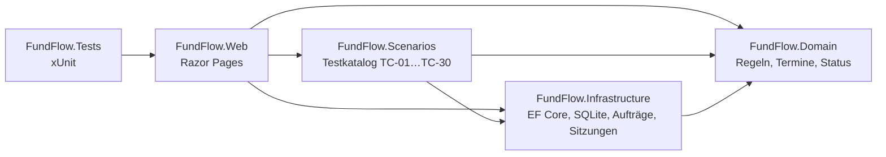
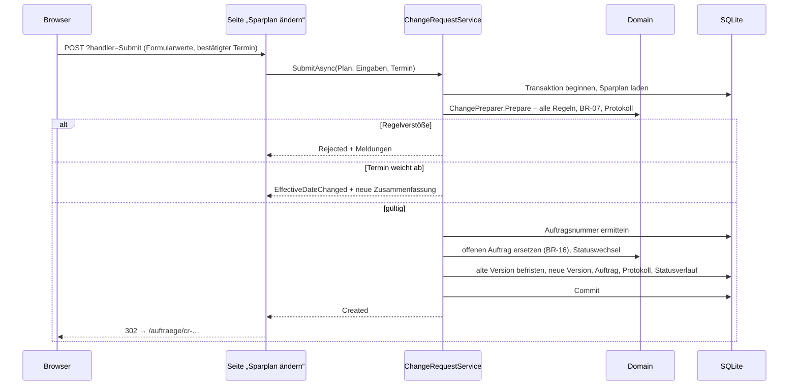

# FundFlow – Architektur

**Stand:** 8. Oktober 2026 · bezieht sich auf das Fachkonzept, Version 1.5

Dieses Dokument beschreibt, wie das Fachkonzept technisch umgesetzt ist und warum. Fachliche Begriffe und Regeln sind im [Fachkonzept](01_Fachkonzept.md) definiert; hier wird nur auf sie verwiesen.

## 1. Ziele der Architektur

1. **Fachlogik ohne Oberfläche und Datenbank testbar.** Jede Regel lässt sich mit einem einfachen Funktionsaufruf prüfen.
2. **Vom Fachkonzept zum Code zurückverfolgbar.** Regel-IDs (BR-xx) stehen im Code, Testfall-IDs (TC-xx) in den Tests.
3. **Für eine Person beherrschbar.** Wenige Projekte, keine Infrastruktur, die mehr kann als nötig.
4. **Öffentlich betreibbar.** Getrennte Demo-Daten je Besucher, keine personenbezogenen Eingaben, keine Dienste Dritter.

## 2. Projekte und Abhängigkeiten

| Projekt | Verantwortung | Wichtige Bestandteile |
|---|---|---|
| `FundFlow.Domain` | Fachlogik, frei von Framework-Abhängigkeiten | `ChangeRequestValidator` (BR-01…BR-06, BR-09…BR-15, BR-17), `EffectiveDateCalculator` (BR-07), `ChangePreparer`, `ChangeLogBuilder`, `ChangeRequestStatusModel`, Entitäten |
| `FundFlow.Infrastructure` | Datenhaltung und Verarbeitung | `FundFlowDbContext`, Migrationen, `ChangeRequestService` (BR-08, BR-16), `DemoSessionService`, `OrderQueries`, Musterdaten |
| `FundFlow.Scenarios` | Testfälle als Daten und ihre Ausführung | `TestCatalog`, `ScenarioRunner`, `InMemoryFundFlowDatabase`, `FixedTimeProvider` |
| `FundFlow.Web` | Oberfläche und Demo-Betrieb | Razor Pages, Sitzungs-Cookie, Aufräumdienst, Darstellung |
| `FundFlow.Tests` | Automatisierte Tests aller Ebenen | siehe [Testbericht](03_Testbericht.md) |

Die Domain kennt weder Datenbank noch Web. Das Projekt `Scenarios` liegt unter `src`, weil die Testansicht der Webanwendung dieselben Testfälle ausführt wie xUnit.

## 3. Ablauf „Auftrag absenden“

Die Schritte 1–6 aus Fachkonzept 8.4 sind im Code von `ChangeRequestService.TrySubmitAsync` nummeriert. Eine Auftragsnummer wird erst vergeben, nachdem **alle** Regeln geprüft sind – auch die, die Oberfläche und Zusammenfassung bereits geprüft haben ([DEF-001](04_Fehlerbericht_DEF-001.md)).

## 4. Fachlogik

- **Eingaben bleiben Text, bis die Domain sie liest.** `ChangeRequestInput` enthält Zeichenketten. So ist die Formatprüfung BR-17 Teil der Fachlogik und testbar, statt im Framework zu verschwinden. Der Leser ist bewusst streng: „250.50“ ist ein Formatfehler und wird nicht als 25.050 € gelesen (Fachkonzept 8.5).
- **Alle Verstöße auf einmal.** Der Validator sammelt alle Meldungen mit Regel-ID und Feld (E-10). Ist ein Feld nicht lesbar, entfallen die übrigen Prüfungen nur für dieses Feld.
- **Reine Funktionen.** Validator, Terminberechnung, Änderungsprotokoll und Vorbereitung sind statische Funktionen ohne Zustand. „Heute“ wird als Wert übergeben, nicht gelesen.
- **Status nur über das Statusmodell.** `ChangeRequest.ChangeStatus` lässt nur Übergänge aus Fachkonzept Abschnitt 9 zu und schreibt jeden Wechsel in den Statusverlauf.
- **Datentypen.** Beträge `decimal`, Anteile `int`, Datumswerte `DateOnly`, Zeitstempel `DateTimeOffset` in UTC.

## 5. Datenhaltung

- **EF Core mit SQLite und Migrationen.** Die Datenbank wird beim Start auf den neuesten Stand gebracht. Das Fondsuniversum ist als Stammdaten in der Migration hinterlegt.
- **Demo-Sitzungen in einer gemeinsamen Datenbank (E-11).** Jede sitzungsbezogene Tabelle trägt eine Spalte `DemoSessionId`, die nur als Schatteneigenschaft im `DbContext` existiert – das fachliche Modell kennt sie nicht. Ein globaler Abfragefilter beschränkt jede Abfrage auf die Sitzung der aktuellen Anfrage; neue Datensätze erhalten die Sitzung beim Speichern automatisch. Die Spalte ist zugleich Fremdschlüssel auf `DemoSessions` mit kaskadierendem Löschen: Zurücksetzen und Aufräumen sind jeweils ein einziges `DELETE`.
- **Bewusste Ausnahmen vom Filter.** `IgnoreQueryFilters()` wird nur an zwei Stellen genutzt: bei der datenbankweit fortlaufenden Auftragsnummer und in Tests, die die Trennung prüfen.
- **Auftragsnummer.** Format `CR-JJJJ-NNNNNN`, fortlaufend je Jahr über alle Sitzungen. Ein eindeutiger Index sichert die Nummer; vergeben zwei Sitzungen gleichzeitig dieselbe, wird die Anlage mit frischem Stand bis zu dreimal wiederholt.
- **Verbindung Auftrag ↔ Version.** Der Fremdschlüssel liegt beim Auftrag (`ResultingVersionId`); die Version erreicht ihren Auftrag über die Navigation `CreatedByRequest`. Eine Spalte in beide Richtungen würde beim Speichern eine zirkuläre Abhängigkeit erzeugen (Fachkonzept 10.1).
- **Nichts wird überschrieben.** Ersetzte Aufträge erhalten einen Status, verworfene Versionen eine Markierung. Gelöscht wird nur im Demo-Betrieb (Zurücksetzen, Ablauf nach 24 Stunden).
- **SQLite-Besonderheiten.** `DateTimeOffset` wird als Zahl gespeichert, weil SQLite es sonst nicht vergleichen kann. Beträge werden als Text mit zwei Nachkommastellen abgelegt; gerechnet wird ausschließlich in C#.

## 6. Zeit

„Heute“ ermittelt `BusinessCalendar.Today(TimeProvider)` in der Zeitzone Europe/Berlin. Die Webanwendung nutzt die Systemzeit, Tests und Testansicht einen `FixedTimeProvider` mit festem Referenzdatum. Dadurch sind Grenzfälle wie der Annahmeschluss (TC-19, TC-20) oder Mitternacht in Sommer- und Winterzeit reproduzierbar.

## 7. Oberfläche

- **Razor Pages (E-12).** Klassisches Anfrage-Antwort-Modell; jede Prüfung läuft auf dem Server.
- **Erfassen und Bestätigen auf einer Seite.** Die Werte reisen als Formularfelder mit; beim Absenden wird alles neu geprüft und der bestätigte Wirksamkeitstermin verglichen (Prozessschritt 6).
- **Ohne JavaScript bedienbar.** Fonds hinzufügen und entfernen funktioniert über Server-Handler; ein kleines Skript ergänzt Bedienung ohne Neuladen und die laufende Summe.
- **Bestätigung nach Weiterleitung.** Nach dem Anlegen leitet die Seite auf das Auftragsdetail weiter (Post/Redirect/Get); die Bestätigungsmeldung wird per TempData übergeben.
- **Darstellung.** Farben und Schriften von inspiras.de, Schriften lokal eingebunden. Kennungen wie CR-2026-000001 brechen nicht um. Geprüft bei 375 und 320 Pixel Breite ohne seitliches Scrollen.

## 8. Sicherheit und Datenschutz

| Maßnahme | Umsetzung |
|---|---|
| Serverseitige Prüfung | Alle Regeln beim Prüfen und erneut beim Absenden |
| Schutz der Formulare | Antiforgery-Token auf jedem POST |
| Cookies | nur technisch notwendig, `HttpOnly`, `SameSite`; `Secure` bei HTTPS |
| Keine personenbezogenen Eingaben | nur Beträge, Daten und Auswahl aus fester Liste; keine Freitextfelder |
| Keine Dienste Dritter | Schriften, Skripte und Stile vom eigenen Server |
| Datensparsamkeit | Sitzungsdaten nach 24 Stunden Inaktivität gelöscht |
| Suchmaschinen | `noindex` – die Demo wird gezielt verlinkt, nicht über Suchmaschinen gefunden |
| Transportverschlüsselung | Caddy mit automatischem Zertifikat, HSTS und Sicherheits-Headern; Cookies mit `Secure` ([Betrieb](05_Betrieb.md)) |

## 9. Technische Entscheidungen

| ID | Entscheidung | Begründung | Verworfene Alternative |
|---|---|---|---|
| T-01 | Vier Projekte unter `src` | Fachlogik isoliert testbar; Testkatalog von Tests und Testansicht gemeinsam nutzbar | Ein einziges Webprojekt |
| T-02 | Eingaben als Text bis in die Domain | Formatprüfung BR-17 ist fachlich und testbar | Model Binding auf `decimal` |
| T-03 | Strenger Betragsleser | Verhindert stille Fehlinterpretation („250.50“) | `decimal.Parse` mit Kultur |
| T-04 | Sitzungsspalte als Schatteneigenschaft | Fachmodell bleibt frei von Demo-Technik | Sitzungs-ID in jeder Entität; Datenbankdatei je Besucher (E-11) |
| T-05 | Testfälle als Daten mit Einzelprüfungen | Erwartet/tatsächlich je Prüfung, lesbar für Fachbereich und Test | Nur xUnit-Assertions |
| T-06 | Test vergleicht Katalog mit Fachkonzept | Dokument und Code können nicht unbemerkt auseinanderlaufen | Manuelle Pflege der Matrix |
| T-07 | `TimeProvider` statt `DateTime.Now` | Reproduzierbare Termine und Grenzfälle | Systemzeit in der Fachlogik |
| T-08 | Fehlerbeispiel auf eigenem Branch | Einbau und Behebung bleiben in der Historie nachvollziehbar | Fehler nur beschreiben |

## 10. Bekannte Grenzen

- SQLite erlaubt jeweils nur einen schreibenden Zugriff. Für eine Demo mit wenigen gleichzeitigen Besuchern genügt das; für einen echten Betrieb wäre ein Datenbankserver nötig.
- Statusübergänge nach „fachlich geprüft“ sind nur modelliert (Fachkonzept Abschnitt 9). Ein Auftrag bleibt daher nach seinem Termin „fachlich geprüft“.
- Kalendertage statt Bankarbeitstage (E-01); keine Stornierung (E-09).
- Keine Anmeldung: Die Trennung der Besucher beruht allein auf dem Sitzungs-Cookie. Für erfundene Daten ist das angemessen, für echte nicht.
