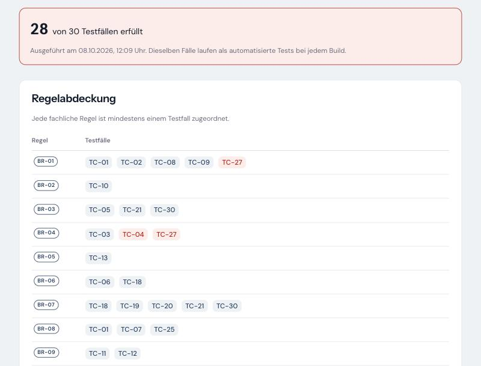
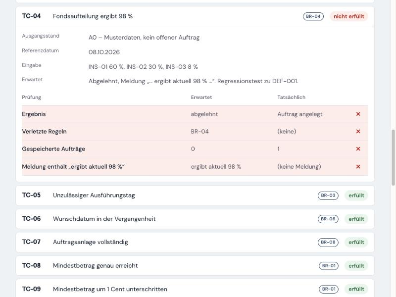

# Fehlerbericht DEF-001

> **Hinweis:** Dieser Fehler wurde zu Demonstrationszwecken **bewusst nachgestellt** (Fachkonzept, Abschnitt 13). Er zeigt, wie ein fachlicher Fehler entdeckt, analysiert, behoben und gegen Wiederholung abgesichert wird. Einbau und Behebung sind als eigene Commits im Repository nachvollziehbar.

| Feld | Inhalt |
|---|---|
| Fehler-ID | DEF-001 |
| Titel | Änderungsauftrag wird trotz 98-prozentiger Fondsaufteilung angelegt |
| Kategorie | Fachlicher Fehler |
| Betroffene Regel | BR-04 (Summe der Anteile = 100 %), BR-08 Schritt 1 (erneute Prüfung vor Anlage) |
| Betroffener Prozessschritt | 6 – erneute Prüfung beim Absenden |
| Priorität | Hoch – fachlich falscher Auftrag wird angelegt und an Operations übergeben |
| Entdeckt durch | automatisierte Testfälle TC-04 und TC-27 |
| Status | behoben, Regressionstests grün |
| Commits | Fehler eingebaut: `4af899a` · Behebung: `4d1504a` · Zusammenführung: `1e27dac` (Branch `def-001`) |

## Beschreibung

Ein Änderungsauftrag mit der Fondsaufteilung 60 % / 30 % / 8 % – zusammen 98 % – wird angelegt, erhält eine Auftragsnummer und den Status „fachlich geprüft“. Im Änderungsprotokoll erscheint die fehlerhafte Aufteilung. In einem realen System würde ein Teil jeder Einzahlung keinem Fonds zugeordnet oder der Auftrag erst im Kernsystem scheitern – nachdem die Kundin bereits eine Bestätigung erhalten hat.

## Reproduktion

1. Sparplan im Ausgangsstand A0 öffnen.
2. Zielanteile auf INS-01 60 %, INS-02 30 % und INS-03 8 % setzen.
3. Formular **ohne vorherige Zusammenfassung** absenden – etwa mit nachträglich veränderten Formulardaten oder durch einen direkten Aufruf von `POST /sparplan/aendern?handler=Submit`.

**Erwartet:** Kein Auftrag; Meldung „Die Fondsaufteilung ergibt aktuell 98 %. Bitte passen Sie die Anteile auf insgesamt 100 % an.“ (BR-04)
**Tatsächlich:** Auftrag CR-2026-000001 wird angelegt.

Über die normale Bedienung tritt der Fehler **nicht** auf: Die Zusammenfassung „Prüfen und bestätigen“ prüft BR-04 weiterhin und lässt 98 % nicht durch. Gerade das macht den Fehler gefährlich – bei manuellen Tests über die Oberfläche bleibt er unsichtbar.

## Wie der Fehler entdeckt wurde

Nach dem Einbau schlugen vier automatisierte Tests fehl:

| Test | Ebene | Befund |
|---|---|---|
| TC-04 (Testkatalog) | Fachlogik und Datenhaltung | Auftrag angelegt statt abgelehnt |
| TC-27 (Testkatalog) | Fachlogik und Datenhaltung | nur BR-01 statt BR-01 und BR-04 gemeldet |
| `TC04_Aufteilung_mit_98_Prozent_…` | Auftragsverarbeitung | Ergebnis `Created` statt `Rejected` |
| Testansicht erreichbar | Weboberfläche | nur noch 28 von 30 Testfällen erfüllt |

Ausgabe von TC-04:

```
TC-04 – Fondsaufteilung ergibt 98 %
  ✗ Ergebnis: erwartet „abgelehnt“, tatsächlich „Auftrag angelegt“
  ✗ Verletzte Regeln: erwartet „BR-04“, tatsächlich „(keine)“
  ✗ Gespeicherte Aufträge: erwartet „0“, tatsächlich „1“
  ✗ Meldung enthält „ergibt aktuell 98 %“: erwartet „ergibt aktuell 98 %“, tatsächlich „(keine Meldung)“
```

Der Webtest, der den Ablauf über die Zusammenfassung abbildet, blieb grün – aus demselben Grund, aus dem auch ein manueller Test den Fehler nicht gefunden hätte. Entdeckt wurde er, weil die Testfälle die Fachlogik direkt ansprechen, unabhängig vom Weg durch die Oberfläche.

Die Testansicht zeigt den Befund auch ohne Entwicklungsumgebung: Die Regelabdeckung markiert genau die Testfälle zu BR-04.





## Ursache

Beim Absenden prüft FundFlow alle Regeln erneut, weil sich zwischen Zusammenfassung und Absenden etwas geändert haben kann (Prozessschritt 6). Diese erneute Prüfung wurde „optimiert“: Die Summe der Anteile galt als bereits geprüft – durch die Live-Summe in der Oberfläche und durch die Zusammenfassung – und wurde beim Absenden ausgelassen.

```csharp
// Die Summe der Anteile wurde bereits in der Oberfläche (Live-Summe) und in der Zusammenfassung
// geprüft – beim Absenden genügt die Prüfung der übrigen Regeln.
var preparation = ChangePreparer.Prepare(input, state.ToValidationContext(), checkAllocationSum: false);
```

Die Annahme ist falsch: Live-Summe und Zusammenfassung sind Komfort für die Kundin, keine Sicherung. Das Formular kann ohne Zusammenfassung oder mit veränderten Werten abgesendet werden. Das Fachkonzept hält das ausdrücklich fest: „Alle Regeln werden serverseitig geprüft. Prüfungen in der Oberfläche dienen nur dem Komfort.“ (Abschnitt 8.1)

## Behebung

Die Ausnahme wurde vollständig entfernt – nicht nur abgeschaltet. Der Parameter `checkAllocationSum` existiert nicht mehr, sodass die Prüfung nicht versehentlich wieder ausgelassen werden kann. Beim Absenden werden alle Regeln geprüft, bevor eine Auftragsnummer vergeben wird (BR-08, Schritt 1):

```csharp
// Schritt 1: erneute Prüfung ALLER Regeln und Neuberechnung – erst danach wird eine Auftragsnummer vergeben.
// Keine Ausnahme für bereits „vorgeprüfte“ Regeln: Live-Summe und Zusammenfassung sind nur Komfort,
// das Formular kann ohne sie oder verändert abgesendet werden (DEF-001).
var preparation = ChangePreparer.Prepare(input, state.ToValidationContext());
```

## Nachweis

- TC-04, TC-27 und der Test der Auftragsverarbeitung sind wieder grün; die Testansicht zeigt 30 von 30.
- **Neuer Regressionstest** `DEF001_direkt_abgesendetes_Formular_mit_98_Prozent_wird_abgelehnt`: sendet das Formular mit 98 % ohne Zusammenfassung ab – genau den Weg, auf dem der Fehler auftrat. Gegenprobe: Gegen den fehlerhaften Stand ausgeführt, schlägt dieser Test fehl.
- Gesamtlauf: 177 von 177 Tests bestanden.

## Erkenntnisse

1. **Serverseitige Prüfung ist nie optional.** Jede Regel, die in der Oberfläche sichtbar ist, muss beim Speichern erneut geprüft werden.
2. **Tests direkt gegen die Fachlogik finden, was Oberflächentests übersehen.** Der Weg über die Zusammenfassung hätte den Fehler verdeckt.
3. **Schalter, die Regeln abschalten, sind ein Warnsignal im Review.** Ein Parameter wie `checkAllocationSum: false` sollte immer begründet und getestet sein – hier war er schlicht falsch.
4. **Regressionstest auf dem Fehlerweg ergänzen.** Der neue Webtest sichert genau den Weg ab, auf dem der Fehler auftrat.

## Rückverfolgbarkeit

| Bezug | Kennung |
|---|---|
| Fachliche Regeln | BR-04, BR-08 |
| Prozess | Abschnitt 7, Schritt 6 |
| User Story | US-02, Akzeptanzkriterium 4 |
| Testfälle | TC-04, TC-27 |
| Regressionstest | `ChangeFlowTests.DEF001_direkt_abgesendetes_Formular_mit_98_Prozent_wird_abgelehnt` |
