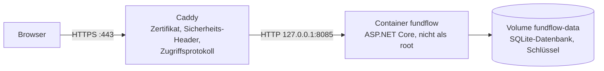

# FundFlow – Betrieb

Die öffentliche Demo läuft unter **https://fundflow.inspiras.de** auf einem Linux-Server (IONOS, Rechenzentrum in Deutschland).

## Aufbau



| Bestandteil | Ort |
|---|---|
| Quellcode | `~/fundflow` (Klon von GitHub) |
| Container | `fundflow`, Image `fundflow:latest`, gebaut aus `Dockerfile` |
| Daten | Docker-Volume `fundflow-data`: `/data/fundflow.db` und `/data/keys` |
| Reverse Proxy | Caddy (Systemdienst), Block aus `deploy/Caddyfile.fundflow` in `/etc/caddy/Caddyfile` |
| Zugriffsprotokoll | `/var/log/caddy/fundflow-access.log`, täglich gewechselt, nach 7 Tagen gelöscht (`/etc/logrotate.d/caddy-fundflow`) |
| Anwendungsprotokoll | `docker logs fundflow`, ohne IP-Adressen, höchstens 3 × 5 MB |

Der Container ist nur auf `127.0.0.1` erreichbar. Von außen führt der einzige Weg über Caddy mit HTTPS. Andere Dienste auf dem Server bleiben unberührt.

## Ersteinrichtung

Voraussetzungen: Docker mit Compose, Caddy als Systemdienst, DNS-Eintrag `fundflow.inspiras.de` auf die IP des Servers.

```bash
git clone https://github.com/klaaba/fundflow.git ~/fundflow
cd ~/fundflow
sudo bash deploy/setup-server.sh
```

Das Skript baut das Image – dabei laufen alle automatisierten Tests; schlägt einer fehl, wird nichts ausgeliefert –, startet den Container, richtet das Zugriffsprotokoll mit Löschung nach 7 Tagen ein und ergänzt Caddy. Vor der Änderung sichert es das Caddyfile und prüft die neue Konfiguration mit `caddy validate`; ist sie ungültig, stellt es die Sicherung wieder her.

## Aktualisieren

Neuen Stand auf GitHub hochladen, dann auf dem Server:

```bash
cd ~/fundflow
bash deploy/update.sh
```

Die Demo-Daten bleiben erhalten; neue Datenbankmigrationen werden beim Start automatisch angewendet.

## Überwachen

```bash
sudo docker ps --filter name=fundflow
sudo docker logs --tail 50 fundflow
curl -I https://fundflow.inspiras.de
```

## Sicherung und Zurücksetzen

Die Datenbank enthält nur erfundene Demo-Daten, die nach 24 Stunden Inaktivität ohnehin gelöscht werden. Eine Sicherung ist daher nicht nötig. Alle Demo-Daten löschen (Neustart mit leerer Datenbank):

```bash
cd ~/fundflow
sudo docker compose down
sudo docker volume rm fundflow_fundflow-data
sudo docker compose up -d
```

Dabei entstehen neue Schlüssel; Besucher mit geöffnetem Formular müssen die Seite einmal neu laden.

## Entfernen

```bash
cd ~/fundflow
sudo docker compose down --volumes --rmi all
sudo rm /etc/logrotate.d/caddy-fundflow /var/log/caddy/fundflow-access.log*
```

Anschließend den Block `fundflow.inspiras.de { … }` aus `/etc/caddy/Caddyfile` entfernen und Caddy neu laden: `sudo systemctl reload caddy`.
